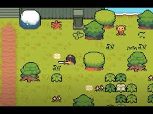
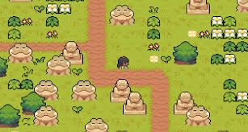

# 🗡️ ZELDA GAME
Welcome to ZELDA GAME, a 2D action-adventure game inspired by the legendary Legend of Zelda series. Built entirely with Python and Pygame, this project brings pixelated heroism, dungeon crawling, and monster slashing to life.

# 🎮 Features
🧍‍♂️ Play as a sword-wielding hero

🐍 Enemies with basic AI behavior

🏰 Multiple maps (overworld, dungeon, etc.)

💥 Attack animations & health system

🎵 Background music & sound effects

💾 Game loop with smooth rendering and event handling

# 📸 Screenshots

# 🚀 Getting Started
Prerequisites
Python 3.7+

Pygame

Installation
Clone this repository:

bash
Copy
Edit
git clone https://github.com/yourusername/zelda-game.git
cd zelda-game
Install dependencies:

bash
Copy
Edit
pip install pygame
Run the game:

bash
Copy
Edit
python main.py
🛠️ Folder Structure
bash
Copy
Edit
zelda-game/
│
├── assets/             # Sprites, sound effects, background music
├── code/               # Core game scripts (player, enemy, map, etc.)
├── levels/             # Map layout files
├── main.py             # Entry point for the game
├── README.md           # You are here!
└── requirements.txt    # Dependencies
⚔️ Controls
Action	Key
Move	Arrow Keys or WASD
Attack	Spacebar
Pause	P
Quit	ESC

# 🧠 How It Works
The game loop handles user input, updates character states, and renders the world every frame.

A sprite-based system is used for character animations and collisions.

Maps are loaded from layout files that define terrain and enemy placement.

Music and sound effects are triggered during events (e.g., attacking, getting hit).

# 💡 Future Plans
Add more enemy types and smarter AI

Inventory system and pickups

Save/load functionality

Boss battles and advanced levels

# 🙌 Contributions
Feel free to fork this repo and submit pull requests. Contributions, feedback, and suggestions are always welcome!

# 📜 License
This project is licensed under the MIT License.

# 👤 Author
Lekhansh Hedau
lekhansh.hedau29@gmail.com

